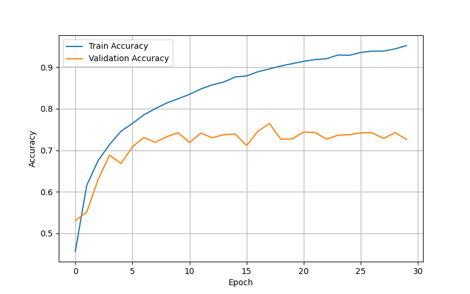
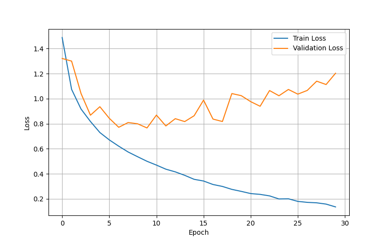

# Computer Vision CNN Experiments

Implementation and comparison of several convolutional neural network architectures for image classification on the CIFAR-10 dataset using PyTorch.

The project includes implementations of VGG16, ResNet, and GoogLeNet built from scratch, as well as experiments with attention mechanisms (Squeeze-and-Excitation and CBAM).

---

## Features

- PyTorch implementation of CNN architectures from scratch
- VGG16
- ResNet
- GoogLeNet
- SE (Squeeze-and-Excitation) blocks
- CBAM (Convolutional Block Attention Module)
- Modular project structure
- Training and validation pipeline
- Automatic checkpoint saving
- Accuracy and loss visualization
- CSV export of experiment metrics

---

## Repository Structure

```
computer-vision-cnn-experiments/
│
├── blocks/          # Building blocks (Residual, Inception, SE, CBAM)
├── configs/         # Training configuration
├── datasets/        # CIFAR-10 dataloader
├── engine/          # Train and test loops
├── models/          # CNN architectures
├── results/
│   ├── csv/
│   ├── plots/
│   └── models/
├── utils/
├── main.py
├── requirements.txt
└── README.md
```

---

## Installation

Clone the repository

```bash
git clone https://github.com/Egor-Pavshuk/computer-vision-cnn-experiments.git
cd computer-vision-cnn-experiments
```

Install dependencies

```bash
pip install -r requirements.txt
```

Download the CIFAR-10 dataset into the `.data/` directory.

---

## Training

Configure hyperparameters in

```
configs/config.py
```

Run training

```bash
python main.py
```

The training pipeline performs:

- model training
- validation
- best model checkpoint saving
- testing
- plots generation
- metrics export

---

## Implemented Architectures

### VGG16

A simplified implementation of the VGG16 architecture adapted for CIFAR-10 classification.

### ResNet

Residual network using custom Residual Blocks with skip connections.

### GoogLeNet

Simplified GoogLeNet architecture based on custom Inception Blocks.

---

## Attention Modules

### Squeeze-and-Excitation (SE)

Implements channel attention using global average pooling and channel-wise feature recalibration.

### CBAM

Sequential Channel Attention and Spatial Attention module improving feature representation.

---

## Experimental Results

Several experiments were conducted to compare:

- baseline CNN models
- ResNet + SE
- ResNet + CBAM

Training history (accuracy and loss) is available in

```
results/plots/
```

Summary metrics are stored in

```
results/csv/
```

---

## Future Improvements

- EfficientNet implementation
- Vision Transformer (ViT)
- MobileNet
- Hyperparameter optimization
- Extend SE and CBAM experiments to VGG16 and GoogLeNet
- Data Augmentation experiments

---

## Technologies

- Python
- PyTorch
- Torchvision
- NumPy
- Matplotlib

| Model | Attention | Test Loss | Test Accuracy |
|-------|-----------|------------|--------------:|
| VGG16 | — | 0.83 | 73.8% |
| GoogLeNet | — | 0.76 | 74.7% |
| ResNet | — | 0.84 | 71% |
| ResNet | SE | 0.83 | 72.8% |
| ResNet | CBAM | 0.85 | 70.8% |

## Training Curves

### Accuracy



### Loss



## Conclusion

This project explored several convolutional neural network architectures implemented from scratch and evaluated on the CIFAR-10 dataset.

Among the baseline models, the simplified GoogLeNet architecture achieved the highest test accuracy in the conducted experiments. This suggests that the multi-branch Inception blocks were effective at extracting diverse feature representations while keeping the model relatively efficient.

Additionally, experiments with SE and CBAM attention modules demonstrated how attention mechanisms can enhance feature extraction and improve classification performance on the evaluated architecture.

Overall, this project provided hands-on experience with:

- implementing CNN architectures from scratch;
- training and evaluating image classification models;
- integrating attention mechanisms (SE and CBAM);
- organizing reproducible deep learning experiments in PyTorch.